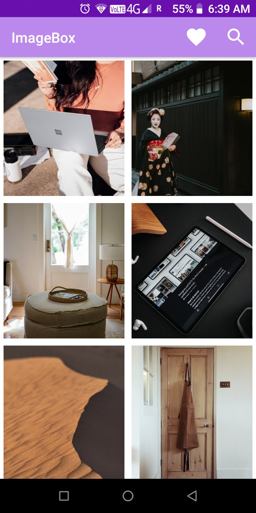
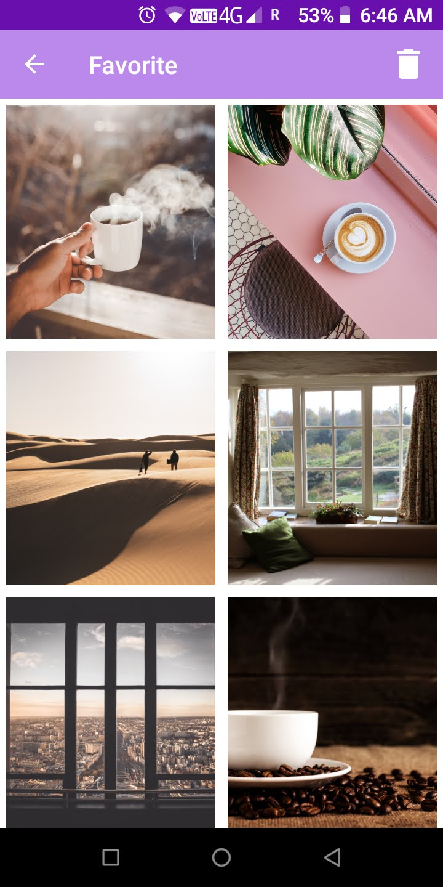

## **ImageBox**
An android app built using Unsplash api (for educational purpose) to display images.
> Display images
> Search images
> Share/download images
> Add/remove to/from favorites

## **Screenshot**
   

## **Video**

## **Icon**

